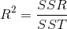
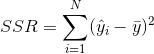
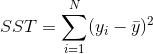

# Example 1: Linear Regression

## Contents
* [Overview](#overview) 
    * [Linear Regression](#linear_regression)
    * [How Good Is The Fit?](#how_good_is_the_fit)
      * [```R^2``` Coefficient](#r2_coefficient)
* [Include files](#include_files)
* [Program structure](#prg_struct)
* [The main function](#m_func)
* [Results](#results)
* [Source Code](#source_code)

## <a name="overview"></a> Overview

This example discusses the linear regression model. In Statistics, linear regression is a mathematical approach to model
the relationship between a scalar response (or dependent variable) and one or more explanatory variables (or independent variables).
The case of one explanatory variable is called simple linear regression.  For more than one explanatory variable, the process is called multiple linear regression
(checkout the wikipedia article <a href="https://en.wikipedia.org/wiki/Linear_regression">Linear regression</a>).

Contrary to classification that is concerned with
class indexes, the outcome of a linear regression model or more general of a regression model is a real number.

### <a name="linear_regression"></a> Linear Regression


### <a name="how_good_is_the_fit"></a> How Good Is The Fit?

So we established the linear regression  model but how can we measure how good it is?
One metric to do so is the so-called ```R^2``` Coefficient also called the Coefficient of determination

#### <a name="r2_coefficient"></a> ```R^2``` Coefficient

The coefficient is defined as



where  SSR and SST are defined respectively as






## <a name="include_files"></a> Import files

```

```

## <a name="m_func"></a> The main function

```
int main(){

    

```

## <a name="results"></a> Results

```

```

## <a name="source_code"></a> Source Code

<a href="Example1.java">Example1.java</a>