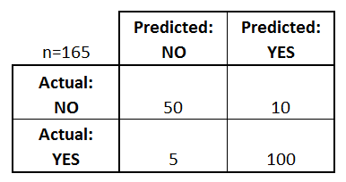

# Example 8: Classification performance assessment using the ```ConfusionMatrix``` class

## Contents
 * [Acknowledgements](#acknowledgement)
 * [Overview](#overview) 
     * [Confusion matrix](#confusion_matrix)
 * [Import files](#include_files)
 * [The main function](#m_func)
 * [Results](#results)
 * [Source Code](#source_code)
 
 ## <a name="acknowledgement"></a> Acknowledgements
 
 This example was largely taken from <a href="https://www.dataschool.io/simple-guide-to-confusion-matrix-terminology/"> Simple guide to confusion matrix terminology</a>
 
 ## <a name="overview"></a> Overview
 
 <a href="../example3/example.md">Example 3</a> introduced the K-Nearest Neighbors and <a href="../example6/example.md">Example 6</a> discussed logistic regression.
 More often than not we want to be able to quantify the performance of a classifier.
 This example introduces various metrics one can do so.
 
 ### <a name="confusion_matrix"></a> Confusion matrix
 
 The confusion matrix is a popular technique to assess the quality of classifier.
 In very simple words the confusion matrix is a square matrix that is used to describe the
 performance of a classification model on a set of test data for which the correct classification
 is known. 
 
 Let's start exploring what a confusion matrix can tell us by considering a binary classifier.
 The following table shows an assumed classifier. 

 
 
Here is what we can immediately infer from that matrix.
  
- Overall we have 165 items in the data set.
- There are two possible classes (binary classification) namely Yes and No.
- The classifier predicted Yes 110 times and No 55 times.
- In reality 60 items are under the class No and 105 under the class Yes.
 
Let'now define some basic terminology that is used when we consider a confusion matrix.
 
- True Positives or TP: The classifier predicts Yes and the are indeed classed as Yes
- True Negatives or TN: The classifier predicts No and they are indeed classed as No
- False Positives or FP: The classifier predicts Yes and but they are  classed as No. This is also known as Type I error
- False Negatives or FN: The classifier predicts No but they are actually classes as Yes. This is also known as Type II error.
  
 Note that all the terms defined above, are whole numbers and not rates.

 Given this terminology here is how we could rewrite the confusion matrix as shown below
 
 
 
 The confusion matrix can be used to compute various rates. The most common ones are:
 
 
- Accuracy: overall it tells us how often is the classifier correct
    - Accuracy = (TP + TN)/total = (100 + 50)/165 = 0.91
- Misclassification rate: overall how often is it wrong. This is also known as the error rate.
    - Misclassification rate = (FP + FN)/total = 10 + 5/165 = 0.09
- True Positive Rate: When it's actually yes, how often does it predict yes? This is also known as sensitivity or recall
    - True Positive Rate = TP/actual Yes = 100/105 = 0.95
- False Positive Rate: When it's actually no, how often does it predict yes? 
    - False Positive Rate = FP/actual No = 10/60 = 0.17
- True Negative Rate: When it's actually no, how often does it predict no? This is also known as specificity
    - True Negative Rate} = TN/actual No = 50/60 = 0.83
- Precision: When it predicts Yes how often is it correct?
    -Precision = TP/Predicted Yes = 100/110 = 0.91
- Prevalence: How often does the yes condition actually occur in our sample?
    - Prevalence = actual Yes/total = 105/165 = 0.64
 
There are other terms worth mentioning but we won't do that here. Instead have a look at 
the following article <a href="https://www.dataschool.io/simple-guide-to-confusion-matrix-terminology/"> Simple guide to confusion matrix terminology</a>.

 
 ## <a name="include_files"></a> Import files
 
 ```
package examples.ml.example8;

import maths.ConfusionMatrix;
import java.util.ArrayList;
import java.util.List;

public class Example8 {

    public static void main(String[] args){

            final int SIZE = 165;
            final int N_CLASSES = 2;

            List<Integer> actual = new ArrayList<>();

            for(int i=0; i< SIZE; ++i){

                if(i < 60){
                    actual.add(0);
                }
                else{
                    actual.add(1);
                }
            }

            List<Integer> predicted = new ArrayList<>();

            for(int i=0; i< SIZE; ++i){

                if(i < 50){
                    predicted.add(0);
                }
                else if(i>=50 && i<65){
                    predicted.add(1);
                }
                else if(i>=65 && i<70){
                    predicted.add(0);
                }
                else{
                    predicted.add(1);
                }
            }

        ConfusionMatrix confusionMatrix = new ConfusionMatrix(actual, predicted, N_CLASSES);

        // let's compute some metrics
        System.out.println("TP: "+confusionMatrix.getClassCounts(1));
        System.out.println("TN: "+confusionMatrix.getClassCounts(0));
        System.out.println("FP: "+confusionMatrix.getClassCountsAsOtherClass(0,1));
        System.out.println("FN: "+confusionMatrix.getClassCountsAsOtherClass(1,0));
        System.out.println("Accuracy is: " + confusionMatrix.accuracy());
        System.out.println("Misclassification Rate: " + confusionMatrix.misclassificationRate());
        System.out.println("TP Rate or Recall: " + confusionMatrix.recallClass(1));
        System.out.println("TN Rate or Specificity: " + confusionMatrix.recallClass(0));
        System.out.println("False Positive Rate: " + (double)confusionMatrix.getClassCountsAsOtherClass(0,1)/60.0);
        System.out.println("Precision: " + (double)confusionMatrix.getClassCounts(1)/
                (double) (confusionMatrix.getClassCountsAsOtherClass(0,1) + confusionMatrix.getClassCounts(1)));
        System.out.println("Prevalence: " + (double)(confusionMatrix.getClassCountsAsOtherClass(1,0) +
                confusionMatrix.getClassCounts(1))/(double) confusionMatrix.totalCount());

    }
}
 ```
 
 ## <a name="results"></a> Results
 
 ```
TP: 100
TN: 50
FP: 10
FN: 5
Accuracy is: 0.9090909090909091
Misclassification Rate: 0.09090909090909094
TP Rate or Recall: 0.9523809523809523
TN Rate or Specificity: 0.8333333333333334
False Positive Rate: 0.16666666666666666
Precision: 0.9090909090909091
Prevalence: 0.6363636363636364

 ```
 
 ## <a name="source_code"></a> Source Code
 
 <a href="Example8.java">Example8.java</a>
